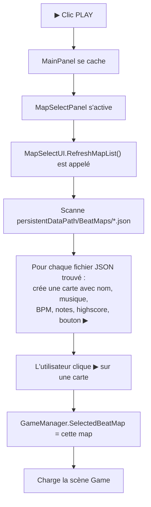

# 🎮 Guide Unity 6 + FMOD — Actions Manuelles dans l'Éditeur

Ce document liste **tout ce qu'il faut configurer à la main dans Unity 6 et FMOD Studio** pour Rythm'em All.

---

## Table des Matières

1. [Installer FMOD](#1--installer-fmod)
2. [Créer le Projet FMOD Studio](#2--créer-le-projet-fmod-studio)
3. [Création des Scènes](#3--création-des-scènes)
4. [Configuration de l'Input System](#4--configuration-de-linput-system)
5. [Scène Game — Setup](#5--scène-game--setup)
6. [Scène MainMenu — Setup](#6--scène-mainmenu--setup)
7. [Scène Editor — Setup](#7--scène-editor--setup)
8. [Prefabs](#8--prefabs)
9. [ScriptableObject Instances](#9--scriptableobject-instances)
10. [UI Canvas et Layout](#10--ui-canvas-et-layout)
11. [Build Settings](#11--build-settings)
12. [Project Settings](#12--project-settings)

---

## 1 — Installer FMOD

### 1.1 FMOD Studio (l'outil auteur)

> [!IMPORTANT]
> FMOD est **gratuit** pour les projets avec moins de $200k de revenus.

1. Aller sur **[fmod.com/download](https://www.fmod.com/download)**
2. Créer un compte (gratuit)
3. Télécharger **FMOD Studio** (version 2.02.x recommandée — la plus stable pour Unity 6)
4. Installer et lancer FMOD Studio

### 1.2 Plugin FMOD for Unity

> [!IMPORTANT]
> Le plugin FMOD doit être installé dans le projet Unity **AVANT** d'ouvrir le projet, sinon les scripts ne compileront pas.

**Méthode 1 — Asset Store (recommandée) :**
1. Dans Unity : `Window > Asset Store` (ou aller sur [assetstore.unity.com](https://assetstore.unity.com/packages/tools/audio/fmod-for-unity-161631))
2. Chercher **"FMOD for Unity"**
3. **Acheter** (gratuit) → **Download** → **Import**
4. Lors de l'import : cocher **tout** et cliquer **Import**

**Méthode 2 — Téléchargement direct :**
1. Sur [fmod.com/download](https://www.fmod.com/download), section **"Unity Integration"**
2. Télécharger le `.unitypackage` pour la version 2.02.x
3. Dans Unity : `Assets > Import Package > Custom Package` → sélectionner le fichier
4. Cocher **tout** → **Import**

### 1.3 Configurer le Plugin dans Unity

Après l'import, un assistant de configuration apparaît :

1. **FMOD > Edit Settings** (menu principal Unity)
2. Dans l'Inspector `FMODStudioSettings` :

| Paramètre | Valeur |
|-----------|--------|
| **Bank Path** | `Assets/StreamingAssets` (par défaut, ne pas toucher) |
| **FMOD Studio Project Path** | Pointer vers ton fichier `.fspro` (voir section 2) |
| **Loading** | `Bank Load Type` = **Load All** (pour un petit projet) |

> [!TIP]
> Si le menu `FMOD` n'apparaît pas, re-démarrer Unity. Le plugin doit compiler d'abord.

---

## 2 — Créer le Projet FMOD Studio

### 2.1 Nouveau Projet

1. **Ouvrir FMOD Studio**
2. `File > New Project`
3. **Enregistrer** dans un dossier **à côté** du projet Unity (pas dedans !) :
   ```
   E:\arn\
   ├── Rythm-em-All\           ← Projet Unity
   └── Rythm-em-All_FMOD\      ← Projet FMOD Studio
       └── RythmEmAll.fspro    ← Fichier projet FMOD
   ```
4. Retourner dans Unity → `FMOD > Edit Settings` → **FMOD Studio Project Path** : naviguer jusqu'à `RythmEmAll.fspro`

### 2.2 Créer la Structure des Bus

Les Bus contrôlent les volumes. Cela se fait dans l'onglet **Mixer** de FMOD Studio :

1. Ouvrir l'onglet **Mixer** (en haut)
2. Le **Master Bus** (`bus:/`) existe déjà
3. **Clic droit** sur Master Bus → `Add Group Bus` → nommer **"Music"** → chemin = `bus:/Music`
4. **Clic droit** sur Master Bus → `Add Group Bus` → nommer **"SFX"** → chemin = `bus:/SFX`

La hiérarchie doit être :
```
bus:/                  (Master)
├── bus:/Music          (Musiques des niveaux)
└── bus:/SFX            (Tous les effets sonores)
```

### 2.3 Importer et Créer les Events Musique

Pour **chaque musique** du jeu :

1. **Glisser le fichier audio** (.ogg, .wav, .mp3) dans l'onglet **Audio Bin** (en bas de FMOD Studio)
   - Ou `File > Import Audio Files`
2. **Créer un dossier** dans l'onglet **Events** : clic droit → `New Folder` → nommer `Music`
3. Dans le dossier `Music`, **clic droit** → `New Event` → `2D Event`
4. **Nommer l'event** : par exemple `NeonRush`
   - Le chemin sera `event:/Music/NeonRush`
5. **Glisser le fichier audio** depuis l'Audio Bin vers la **Timeline** de l'event
6. **Important** : dans les propriétés de l'event, vérifier :
   - **Output** : sélectionner **Music** (le bus créé à l'étape 2.2)
   - **Polyphony** : 1 (une seule instance)
7. **Optionnel** : ajouter un **Tempo marker** dans la timeline :
   - Clic droit sur la timeline → `Add Tempo Marker`
   - Entrer le BPM de la chanson
   - Cela permettra à FMOD de fournir des informations de beat

8. **Répéter** pour chaque musique

### 2.4 Créer les Events SFX

Pour les effets sonores du gameplay :

1. Créer un dossier `SFX` dans Events
2. Pour chaque SFX, **clic droit** → `New Event` → `2D Event` :

| Nom Event | Chemin | Bus | Description |
|-----------|--------|-----|-------------|
| `HitPerfect` | `event:/SFX/HitPerfect` | SFX | Son satisfaisant, brillant |
| `HitGood` | `event:/SFX/HitGood` | SFX | Son neutre, acceptation |
| `HitMiss` | `event:/SFX/HitMiss` | SFX | Son buzzer / erreur |
| `TooSoon` | `event:/SFX/TooSoon` | SFX | Son d'alerte (trop tôt) |
| `TooLate` | `event:/SFX/TooLate` | SFX | Son doux / raté de justesse |
| `Warning` | `event:/SFX/Warning` | SFX | Son de warning pré-spawn |
| `Dash` | `event:/SFX/Dash` | SFX | Whoosh de dash |
| `EnemyExplode` | `event:/SFX/EnemyExplode` | SFX | Explosion ennemi |
| `MetronomeClick` | `event:/SFX/MetronomeClick` | SFX | Clic de métronome |
| `MetronomeAccent` | `event:/SFX/MetronomeAccent` | SFX | Clic accentué (temps fort) |

> [!TIP]
> Pour chaque event SFX :
> - Glisser un fichier audio dans la timeline
> - Passer le **Output** sur le bus **SFX**
> - Mettre la **Polyphony** à 4+ (peuvent superposer)

### 2.5 Build les Banks

> [!IMPORTANT]
> **À faire à chaque modification dans FMOD Studio !**

1. Dans FMOD Studio : `File > Build` (ou `F7`)
2. Vérifie que les fichiers `.bank` sont générés dans :
   ```
   E:\arn\Rythm-em-All\Assets\StreamingAssets\
   ├── Master.bank
   ├── Master.strings.bank
   └── (autres banks si tu en as créé)
   ```
3. **Retourner dans Unity** — les banks se chargent automatiquement

> [!WARNING]
> Si les banks ne se retrouvent pas dans `StreamingAssets`, vérifier dans FMOD Studio :
> - `Edit > Preferences > Build` → **Built Banks Output Directory** doit pointer vers `E:\arn\Rythm-em-All\Assets\StreamingAssets`
> - Ou configurer le path dans `FMOD > Edit Settings` dans Unity

### 2.6 Vérifier dans Unity

1. Ouvrir Unity
2. `FMOD > Event Browser` — tu devrais voir tous tes events :
   ```
   event:/Music/NeonRush
   event:/SFX/HitPerfect
   event:/SFX/Dash
   ...
   ```
3. Cliquer sur un event → bouton **Play** dans le browser pour tester

---

## 3 — Création des Scènes

> [!IMPORTANT]
> Créer 3 scènes dans `Assets/Scenes/` :

| Scène | Fichier | Comment |
|-------|---------|---------|
| Main Menu | `MainMenu.unity` | `File > New Scene > Basic (URP)` puis `Save As` |
| Game | `Game.unity` | `File > New Scene > Basic (URP)` puis `Save As` |
| Editor | `Editor.unity` | `File > New Scene > Basic (URP)` puis `Save As` |

- Tu peux supprimer `SampleScene.unity` une fois les nouvelles scènes prêtes.

---

## 4 — Configuration de l'Input System

> [!IMPORTANT]
> Modifier le fichier `InputSystem_Actions.inputactions` dans Unity.

### Actions à ajouter dans la Map "Player" :

| Action | Type | Bindings Clavier | Bindings Manette |
|--------|------|-------------------|-------------------|
| **AttackLeft** | Button | `Mouse/leftButton` | `Gamepad/leftTrigger` |
| **AttackRight** | Button | `Mouse/rightButton` | `Gamepad/rightTrigger` |
| **Dash** | Button | `Keyboard/space` | `Gamepad/buttonSouth` (A) |

### Comment faire :
1. Double-cliquer sur `InputSystem_Actions.inputactions` dans le Project
2. Dans la map **Player** :
   - Cliquer **+** à droite de "Actions" → nommer `AttackLeft`
     - Type : `Button`
     - Ajouter binding : `<Mouse>/leftButton` pour Keyboard&Mouse
     - Ajouter binding : `<Gamepad>/leftTrigger` pour Gamepad
   - Cliquer **+** → nommer `AttackRight`
     - Type : `Button`
     - Ajouter binding : `<Mouse>/rightButton` pour Keyboard&Mouse
     - Ajouter binding : `<Gamepad>/rightTrigger` pour Gamepad
   - Cliquer **+** → nommer `Dash`
     - Type : `Button`
     - Ajouter binding : `<Keyboard>/space` pour Keyboard&Mouse
     - Ajouter binding : `<Gamepad>/buttonSouth` pour Gamepad
3. **Supprimer** les actions inutiles : `Jump`, `Crouch`, `Sprint`, `Interact`, `Previous`, `Next`, `Look`
4. **Save Asset** (Ctrl+S dans la fenêtre Input Actions)

### Nouvelle Map "Editor" à créer :

| Action | Type | Bindings Clavier |
|--------|------|-------------------|
| **NavigateGrid** | Value (Vector2) | ZQSD (composite Dpad) |
| **PlaceSimple** | Button | `Keyboard/space` |
| **PlaceLeft** | Button | `Keyboard/a` |
| **PlaceRight** | Button | `Keyboard/e` |
| **PlaceBoth** | Button | `Keyboard/z` |
| **PlaceSpam** | Button | `Keyboard/s` |
| **PlayPause** | Button | `Keyboard/p` |
| **Delete** | Button | `Keyboard/delete` |

---

## 5 — Scène Game — Setup

### 5.1 Caméra
1. Sélectionner la **Main Camera** existante
2. **Position** : `(0, 15, 0)` — vue du dessus
3. **Rotation** : `(90, 0, 0)` — regarde vers le bas
4. **Projection** : `Orthographic`
5. **Size** : `12` (ajuster selon la taille de l'arène)

### 5.2 Arène (terrain de jeu)
1. `GameObject > 3D Object > Plane` → nommer **"Arena"**
2. **Position** : `(0, 0, 0)`
3. **Scale** : `(2, 1, 2)` — carré de 20×20 unités
4. Matériau : Créer un matériau URP avec une couleur sombre ou une texture
5. Layer : `Default`

### 5.3 Murs invisibles (optionnel)
Créer 4 cubes fins autour de l'arène :
- Désactiver leur `MeshRenderer`, garder le `BoxCollider`

| Mur | Position | Scale |
|-----|----------|-------|
| Haut | `(0, 0.5, 10)` | `(20, 1, 0.5)` |
| Bas | `(0, 0.5, -10)` | `(20, 1, 0.5)` |
| Gauche | `(-10, 0.5, 0)` | `(0.5, 1, 20)` |
| Droite | `(10, 0.5, 0)` | `(0.5, 1, 20)` |

### 5.4 Spawners + Warning Indicators

> [!IMPORTANT]
> Placer **12 spawners** sur les bords de l'arène (**3 par côté**).
> Chaque spawner a besoin d'un **WarningIndicator** enfant pour afficher un signal visuel avant qu'un ennemi n'apparaisse.

Pour chaque spawner :

1. `GameObject > Create Empty` → nommer `Spawner_Top_0`, `Spawner_Top_1`, etc.
2. `Add Component` → `EnemySpawner`
3. Positionner **juste en dehors** de l'arène :

| Côté | Positions (3 par côté) | Direction (vers le centre) |
|------|-------------------------------|----------------------|
| **Haut** | `(-7, 0, 12)`, `(0, 0, 12)`, `(7, 0, 12)` | `(0, 0, -1)` |
| **Bas** | `(-7, 0, -12)`, `(0, 0, -12)`, `(7, 0, -12)` | `(0, 0, 1)` |
| **Gauche** | `(-12, 0, 7)`, `(-12, 0, 0)`, `(-12, 0, -7)` | `(1, 0, 0)` |
| **Droite** | `(12, 0, 7)`, `(12, 0, 0)`, `(12, 0, -7)` | `(-1, 0, 0)` |

4. Dans l'Inspector :
   - `Spawner Index` : **0 à 11**
   - `Spawn Direction` : la direction correspondante

#### 5.4.1 Créer le Warning Indicator (pour CHAQUE spawner)

1. **Clic droit** sur le Spawner dans la Hierarchy → `2D Object > Sprite > Square`
   - *(ou `GameObject > Create Empty` puis `Add Component > Sprite Renderer`)*
2. **Renommer** l'enfant `WarningIndicator`
3. Dans l'Inspector du `WarningIndicator` :
   - **Position** : `(0, 0.1, 0)` (légèrement au-dessus du sol)
   - **Rotation** : `(90, 0, 0)` (à plat au sol)
   - **Scale** : `(2, 2, 1)` (assez grand pour être visible)
4. **SpriteRenderer** :
   - **Sprite** : `UISprite` (le carré blanc par défaut de Unity) ou n'importe quel sprite
   - **Color** : rouge `(255, 0, 0)` avec **Alpha = 0** (invisible par défaut — le script gère l'alpha)
5. `Add Component` → taper `WarningIndicator` → sélectionner
6. Dans le composant `WarningIndicator` :

| Champ | Valeur |
|---|---|
| `Sprite Renderer` | Glisser le **SpriteRenderer** du même objet (lui-même) |
| `Blink Rate` | `3` |
| `Min Alpha` | `0.2` |
| `Max Alpha` | `1` |

7. **Brancher dans le Spawner parent** :
   - Sélectionner le **Spawner** parent
   - Dans `EnemySpawner` → champ `Warning Indicator` → **glisser l'enfant `WarningIndicator`**

8. **Répéter pour les 12 spawners**

> [!TIP]
> **Raccourci** : configure un seul spawner avec son Warning, puis sélectionne-le → `Ctrl+D` pour dupliquer. Ajuste ensuite la position, le Spawner Index, et le Spawn Direction de chaque copie.

5. Regrouper tous les spawners sous un parent vide `"Spawners"`

---

### 5.5 Player

1. `GameObject > 3D Object > Capsule` (ou sprite 2D)
2. **Position** : `(0, 0.5, 0)` — centre de l'arène
3. **Tag** : `Player`
4. **Composants à ajouter** (via `Add Component` pour chaque) :
   - `Rigidbody` → cocher **Freeze Rotation** (X, Y, Z) + **Freeze Position Y**
   - `CapsuleCollider`
   - `PlayerController`
   - `PlayerMovement`
   - `PlayerCombat`
   - `PlayerDash`
   - `PlayerHealth`

#### 5.5.1 Configurer PlayerCombat

Dans l'Inspector, section `PlayerCombat` :

| Champ | Valeur | Description |
|---|---|---|
| `Hit Range` | `3` | Portée d'attaque en unités |
| `Both Input Window` | `0.1` | Fenêtre pour le double-clic (Both) |
| `Attack Flash Color` | `#FF4D4D` (rouge clair) | Couleur du flash quand le joueur frappe |
| `Attack Flash Duration` | `0.08` | Durée du flash en secondes |
| `Show Range In Game` | ✅ coché | Affiche un cercle rouge autour du joueur en jeu |
| `Range Circle Color` | `#FF000044` (rouge semi-transparent) | Couleur du cercle |

**SFX FMOD** (ouvrir `FMOD > Event Browser` → glisser les events) :

| Champ | Event FMOD |
|---|---|
| `sfxPerfect` | `event:/SFX/HitPerfect` |
| `sfxGood` | `event:/SFX/HitGood` |
| `sfxMiss` | `event:/SFX/HitMiss` |
| `sfxTooSoon` | `event:/SFX/TooSoon` |
| `sfxTooLate` | `event:/SFX/TooLate` |

> [!TIP]
> **Range d'attaque visible** : un cercle rouge est toujours visible dans la **Scene View** grâce aux Gizmos. Si `Show Range In Game` est coché, un `LineRenderer` est aussi affiché **en jeu** pour le joueur.

#### 5.5.2 Configurer PlayerDash

| Champ | Event FMOD |
|---|---|
| `dashSFX` | `event:/SFX/Dash` |

#### 5.5.3 Configurer PlayerHealth

| Champ | Valeur |
|---|---|
| `HP Slider` | Glisser le Slider `HPBar` du Canvas (voir section 5.8) |
| `Flash Color` | `#CC0000` (rouge foncé) — flash quand le joueur frappe hors timing |
| `Flash Duration` | `0.3` |

#### 5.5.4 Configurer PlayerController

| Champ | Glisser |
|---|---|
| `Config` | `PlayerConfig.asset` depuis `Assets/Scriptable Objects/` |
| `Movement` | Se remplit automatiquement |
| `Combat` | Se remplit automatiquement |
| `Dash` | Se remplit automatiquement |
| `Health` | Se remplit automatiquement |

---

### 5.6 Managers (GameObjects vides)

> [!IMPORTANT]
> Plus besoin d'AudioSource sur aucun manager. FMOD gère tout.

Créer ces GameObjects vides (`GameObject > Create Empty`) et attacher les scripts :

| GameObject | Scripts à attacher |
|-----------|-------------------|
| **GameManager** | `GameManager.cs` |
| **FMODAudioManager** | `FMODAudioManager.cs` |
| **SpeedMultiplier** | `SpeedMultiplier.cs` |
| **ScoreManager** | `ScoreManager.cs` |
| **BeatManager** | `BeatManager.cs` |
| **EnemySpawnManager** | `EnemySpawnManager.cs` |
| **TimingJudge** | `TimingJudge.cs` |
| **TimingFeedbackUI** | `TimingFeedbackUI.cs` |

#### 5.6.1 Configurer GameManager

| Champ Inspector | Que glisser dedans |
|---|---|
| `Game Config` | `GameConfig.asset` (depuis `Assets/Scriptable Objects/`) |
| `Player Config` | `PlayerConfig.asset` |
| `Player` | Le GameObject `Player` de la scène |
| `Music Database` | `MusicDatabase.asset` |

#### 5.6.2 Configurer EnemySpawnManager

| Champ Inspector | Que glisser dedans |
|---|---|
| `Spawners` | Déplier la liste → glisser les **12 spawners** un par un |
| `Enemy Data Simple` | `Enemy_Simple.asset` |
| `Enemy Data Left` | `Enemy_Left.asset` |
| `Enemy Data Right` | `Enemy_Right.asset` |
| `Enemy Data Both` | `Enemy_Both.asset` |
| `Enemy Data Spam` | `Enemy_Spam.asset` |
| `Look Ahead Beats` | `4` |
| `Warning Ahead Beats` | `6` (doit être > Look Ahead pour que le warning apparaisse AVANT l'ennemi) |
| `Wave Gap Seconds` | `5` (Nouveau) |
| `Player Health` | Glisser le `Player` (se remplit automatiquement au lancement si vide) |

> [!TIP]
> **Le Système de Vagues (Waves)**
> `EnemySpawnManager` regroupe automatiquement les notes en "vagues". Si deux notes sont séparées par plus de `Wave Gap Seconds` (ex: 5 secondes), elles sont considérées comme deux vagues distinctes.
> **Comportement des warnings** : Au lieu d'apparaître pour chaque ennemi individuellement, les warnings s'affichent simultanément **au début de chaque vague**, sur TOUS les spawners qui seront utilisés pendant cette vague.

#### 5.6.3 Configurer TimingFeedbackUI

> [!IMPORTANT]
> C'est le système qui affiche "PERFECT!", "GOOD", "TOO SOON", etc.

| Champ Inspector | Que glisser dedans |
|---|---|
| `Feedback Prefab` | Le prefab `FeedbackText3D.prefab` (voir 5.6.4) |
| `Display Duration` | `0.6` |
| `Float Up Distance` | `1.5` |
| `Screen Feedback Text` | `GameCanvas > TimingFeedbackText` (voir section 5.8) |

#### 5.6.4 Créer le Prefab de Feedback 3D

> [!IMPORTANT]
> Ce prefab affiche "PERFECT!", "GOOD", etc. **au-dessus de l'ennemi** quand il est tué.

1. `GameObject > 3D Object > Text - TextMeshPro` → renommer `FeedbackText3D`
2. Inspector :
   - **TextMeshPro** : Text = `PERFECT!`, Font Size = `8`, Alignment = `Center`
   - **RectTransform** : Width = `4`, Height = `1`
   - **Rotation** : `(90, 0, 0)` (pour être lisible en vue top-down)
3. **Glisser** le GO depuis la Hierarchy vers `Assets/Prefabs/` → le transformer en **Prefab**
4. **Supprimer** l'instance de la scène
5. Glisser `Assets/Prefabs/FeedbackText3D.prefab` dans le champ `Feedback Prefab` de `TimingFeedbackUI`

---

### 5.7 FMOD Studio Listener

1. Sélectionner la **Main Camera**
2. **Supprimer** le composant `AudioListener` (clic droit → Remove Component)
3. `Add Component` → `FMOD Studio Listener`
4. **Attenuate** : décocher (pas d'atténuation 3D pour un jeu top-down)

---

### 5.8 UI — Game HUD (Canvas)

1. `GameObject > UI > Canvas` → renommer `GameCanvas`
2. **Canvas Scaler** : `Scale With Screen Size`, `1920 × 1080`, Match = `0.5`

```
GameCanvas
├── HPBar (UI > Slider)
│   ├── Anchor : Bottom-Center, Pos Y = 50
│   ├── Width: 400, Height: 30
│   └── Background Color : #333333
├── ScoreText (UI > Text - TextMeshPro)
│   ├── Anchor : Top-Right, Pos = (-120, -30)
│   ├── Font Size : 28, Text : "Score: 0"
├── ComboText (UI > Text - TextMeshPro)
│   ├── Anchor : Top-Center, Pos Y = -30
│   ├── Font Size : 36, Text : "Combo: 0"
├── MultiplierText (UI > Text - TextMeshPro)
│   ├── Anchor : Top-Center, Pos Y = -70
│   ├── Font Size : 20, Text : "x1.0"
├── SpeedText (UI > Text - TextMeshPro)
│   ├── Anchor : Top-Left, Pos = (120, -30)
│   ├── Font Size : 20, Text : "Speed: 1.0x"
├── TimingFeedbackText (UI > Text - TextMeshPro)
│   ├── Anchor : Center, Pos Y = 100
│   ├── Font Size : 72, Alignment : Center
│   ├── Color : blanc, Alpha = 0 (invisible par défaut)
│   └── Text : "" (vide — le script le remplit)
└── PauseMenu (UI > Panel, désactivé par défaut)
    ├── ResumeButton (Button-TMP, "RESUME")
    ├── RestartButton (Button-TMP, "RESTART")
    └── QuitButton (Button-TMP, "QUIT")
```

> [!IMPORTANT]
> **Brancher `TimingFeedbackText`** : sélectionner le GO `TimingFeedbackUI` → champ `Screen Feedback Text` → glisser `GameCanvas > TimingFeedbackText`

> [!IMPORTANT]
> **Brancher `HPBar`** : sélectionner le `Player` → `PlayerHealth` → champ `HP Slider` → glisser `GameCanvas > HPBar`

Attacher `GameUI.cs` sur le Canvas ou un GO vide.

---


## 6 — Scène MainMenu — Setup (Guide détaillé pas-à-pas)

> [!IMPORTANT]
> **Prérequis** : FMOD installé (sections 1-2), TextMeshPro importé (section 10.1), les 3 scènes créées (section 3).

### 6.1 Étape 1 — Ouvrir la scène et préparer les Managers

1. Dans le panneau **Project** (en bas), naviguer dans `Assets > Scenes`
2. **Double-cliquer** sur `MainMenu.unity` pour ouvrir la scène
3. Dans le panneau **Hierarchy** (à gauche), tu vois `Main Camera`, `Directional Light`, etc.

#### Créer le FMODAudioManager :
1. Menu `GameObject > Create Empty` → un nouvel objet apparaît dans la Hierarchy
2. **Cliquer une fois** dessus dans la Hierarchy → le nom est sélectionné → taper `FMODAudioManager` → appuyer **Entrée**
3. Dans le panneau **Inspector** (à droite), cliquer sur le bouton `Add Component`
4. Dans la barre de recherche qui apparaît, taper `FMODAudioManager`
5. Cliquer sur `FMODAudioManager` dans les résultats → le script est ajouté

#### Remplacer l'AudioListener par FMOD Studio Listener :
1. Cliquer sur **Main Camera** dans la Hierarchy
2. Dans l'Inspector, trouver le composant `Audio Listener`
3. **Clic droit** sur le titre `Audio Listener` → `Remove Component`
4. Cliquer `Add Component` → taper `Studio Listener` → sélectionner **`FMOD Studio Listener`**

---

### 6.2 Étape 2 — Créer le Canvas principal

1. Menu `GameObject > UI > Canvas` → un objet `Canvas` apparaît dans la Hierarchy
2. **Renommer** le Canvas : clic droit dessus → `Rename` → taper `MainMenuCanvas` → **Entrée**
3. Un **EventSystem** est automatiquement créé. Si le composant `Input System UI Input Module` n'est pas dessus, cliquer sur `EventSystem` → `Add Component` → taper `Input System UI Input Module` → sélectionner

#### Configurer le Canvas Scaler :
1. Sélectionner `MainMenuCanvas` dans la Hierarchy
2. Dans l'Inspector, trouver le composant **Canvas Scaler**
3. Régler les valeurs :

| Paramètre | Valeur |
|---|---|
| UI Scale Mode | `Scale With Screen Size` |
| Reference Resolution X | `1920` |
| Reference Resolution Y | `1080` |
| Match Width Or Height | `0.5` |

---

### 6.3 Étape 3 — Créer le MainPanel (panneau des boutons principaux)

C'est le panneau affiché par défaut avec PLAY, EDITOR, OPTIONS, QUIT.

1. **Clic droit** sur `MainMenuCanvas` dans la Hierarchy → `UI > Panel` → renommer `MainPanel`
2. Dans l'Inspector du `MainPanel`, configurer le **RectTransform** :
   - Anchor Preset : cliquer sur le carré en haut à gauche → choisir `stretch-stretch` (le dernier en bas à droite, en maintenant **Alt**)
   - Left : `0`, Right : `0`, Top : `0`, Bottom : `0` (remplit tout l'écran)
3. Couleur du **Image** component : `#1A1A2E` (bleu sombre)

#### Créer le titre :
1. Clic droit sur `MainPanel` → `UI > Text - TextMeshPro` → renommer `TitleText`
   - *(Si la popup "Import TMP Essentials" apparaît, cliquer **Import TMP Essentials**)*
2. Dans l'Inspector :
   - **RectTransform** : Anchor = `Top-Center`, Pos Y = `-120`, Width = `800`, Height = `120`
   - **TextMeshPro** : Text = `Rythm'em All`, Font Size = `72`, Alignment = `Center`, Color = blanc

#### Créer les 4 boutons :
Pour chaque bouton, suivre cette procédure exacte :

1. Clic droit sur `MainPanel` → `UI > Button - TextMeshPro` → renommer selon le tableau
2. Configurer dans l'Inspector :

| Nom du bouton | Texte affiché | Pos Y | Width | Height |
|---|---|---|---|---|
| `PlayButton` | `PLAY` | `-250` | `300` | `60` |
| `EditorButton` | `EDITOR` | `-330` | `300` | `60` |
| `OptionsButton` | `OPTIONS` | `-410` | `300` | `60` |
| `QuitButton` | `QUIT` | `-490` | `300` | `60` |

Pour chaque bouton :
- **RectTransform** : Anchor = `Top-Center`, Pos X = `0`, Width et Height selon tableau
- Déplier le bouton dans la Hierarchy (cliquer la flèche `▶`) → cliquer sur l'enfant `Text (TMP)` → changer le texte selon le tableau, Font Size = `28`

---

### 6.4 Étape 4 — Créer le MapSelectPanel (panneau de sélection des maps)

> [!IMPORTANT]
> Ce panneau s'affiche quand on clique sur PLAY. Il contient une **liste verticale scrollable** de cartes. Chaque carte affiche le nom de la map, la musique, le BPM, le highscore, et un bouton ▶ pour lancer directement.

#### 6.4.1 Créer le panneau container

1. **Clic droit** sur `MainMenuCanvas` dans la Hierarchy → `UI > Panel` → renommer `MapSelectPanel`
2. Dans l'Inspector :
   - **RectTransform** : Anchor = `stretch-stretch` (Alt + dernier preset en bas à droite)
   - Left : `0`, Right : `0`, Top : `0`, Bottom : `0`
   - Image Color : `#1A1A2E`
3. **Désactiver** le panel : dans l'Inspector, **décocher la case** tout en haut à gauche à côté du nom `MapSelectPanel` (la checkbox active/inactive)

> [!TIP]
> Le panel est désactivé par défaut car il n'est visible que quand on clique sur PLAY. Le script `MainMenuUI.cs` l'active/désactive automatiquement.

#### 6.4.2 Créer le titre du panneau

1. Clic droit sur `MapSelectPanel` → `UI > Text - TextMeshPro` → renommer `MapSelectTitle`
2. Inspector :
   - **RectTransform** : Anchor = `Top-Center`, Pos Y = `-60`, Width = `600`, Height = `60`
   - **TextMeshPro** : Text = `SÉLECTION DE MAP`, Font Size = `36`, Alignment = `Center`, Color = blanc

#### 6.4.3 Créer le ScrollView (la liste scrollable)

> [!IMPORTANT]
> Le ScrollView est le composant clé. C'est lui qui permet de scroller la liste de maps quand il y en a beaucoup.

1. Clic droit sur `MapSelectPanel` → `UI > Scroll View` → renommer `MapListScrollView`
2. Dans l'Inspector du `MapListScrollView`, configurer le **RectTransform** :
   - Anchor : `stretch-stretch`
   - Left : `100`, Right : `100`, Top : `120`, Bottom : `80`
   
   *(Cela laisse 120px en haut pour le titre et 80px en bas pour le bouton retour)*

3. Dans le composant **Scroll Rect** :
   - **Horizontal** : **décocher** (on ne scroll que verticalement)
   - **Vertical** : **cocher** ✅
   - **Movement Type** : `Clamped`

4. **Optionnel** : supprimer la scrollbar horizontale
   - Dans la Hierarchy, déplier `MapListScrollView`
   - Si tu vois `Scrollbar Horizontal`, **clic droit dessus → Delete**
   - Dans le Scroll Rect du `MapListScrollView`, mettre le champ `Horizontal Scrollbar` à `None`

#### 6.4.4 Configurer le Content (le parent des cartes)

> [!IMPORTANT]
> Le `Content` est le GameObject **à l'intérieur** du ScrollView. C'est le parent de toutes les cartes de map. Le script `MapSelectUI.cs` va y instancier les cartes dynamiquement.

1. Dans la Hierarchy, **déplier** `MapListScrollView` → `Viewport` → cliquer sur **`Content`**
2. Dans l'Inspector de `Content`, vérifier/ajouter ces composants :

**RectTransform :**
- Anchor : `Top-Stretch` (le preset en haut au centre avec les flèches horizontales)
- Pivot : X = `0.5`, Y = `1`
- Left : `0`, Right : `0`, Top : `0`

**Ajouter `Vertical Layout Group`** (si pas déjà présent) :
1. `Add Component` → taper `Vertical Layout Group` → sélectionner
2. Régler :

| Paramètre | Valeur |
|---|---|
| Padding Left | `10` |
| Padding Right | `10` |
| Padding Top | `10` |
| Padding Bottom | `10` |
| Spacing | `8` |
| Child Alignment | `Upper Center` |
| Control Child Size Width | ✅ coché |
| Control Child Size Height | ❌ décoché |
| Child Force Expand Width | ✅ coché |
| Child Force Expand Height | ❌ décoché |

**Ajouter `Content Size Fitter`** (si pas déjà présent) :
1. `Add Component` → taper `Content Size Fitter` → sélectionner
2. Régler :

| Paramètre | Valeur |
|---|---|
| Horizontal Fit | `Unconstrained` |
| Vertical Fit | `Preferred Size` |

> [!TIP]
> Le `Content Size Fitter` en mode `Preferred Size` fait que le Content grandit automatiquement quand on ajoute des cartes. C'est ce qui permet le scroll quand il y a beaucoup de maps.

#### 6.4.5 Créer le bouton Retour

1. Clic droit sur `MapSelectPanel` → `UI > Button - TextMeshPro` → renommer `MapSelectBackButton`
2. Inspector :
   - **RectTransform** : Anchor = `Bottom-Center`, Pos Y = `40`, Width = `200`, Height = `50`
   - Déplier le bouton → cliquer `Text (TMP)` → Text = `RETOUR`, Font Size = `24`

#### 6.4.6 Attacher le script MapSelectUI

1. **Sélectionner `MapSelectPanel`** dans la Hierarchy
2. `Add Component` → taper `MapSelectUI` → sélectionner
3. Dans l'Inspector, le script `MapSelectUI` montre plusieurs champs à remplir :

| Champ Inspector | Que glisser dedans | Comment |
|---|---|---|
| `Map List Content` | **`Content`** (enfant de `Viewport` dans le ScrollView) | Déplier `MapListScrollView > Viewport > Content` dans la Hierarchy, puis **glisser-déposer** `Content` dans ce champ |
| `Map Card Prefab` | `null` (laisser vide) | Les cartes sont créées dynamiquement par le code, pas besoin de prefab |
| `Back Button` | `MapSelectBackButton` | Glisser le bouton depuis la Hierarchy |

> [!IMPORTANT]
> **Le champ `Map List Content` est le plus important.** C'est ici que le script va créer les cartes de map. Si ce champ est vide, rien ne s'affichera !
> Le chemin dans la Hierarchy est : `MainMenuCanvas > MapSelectPanel > MapListScrollView > Viewport > Content`

La hiérarchie finale du `MapSelectPanel` dans Unity doit ressembler à ceci :
```
MapSelectPanel (désactivé par défaut)
├── MapSelectTitle (Text - TextMeshPro : "SÉLECTION DE MAP")
├── MapListScrollView (Scroll View)
│   ├── Viewport
│   │   └── Content  ← C'est CE GameObject qu'il faut glisser dans "Map List Content"
│   │       └── (les cartes seront créées ici automatiquement par le script)
│   └── Scrollbar Vertical
└── MapSelectBackButton (Button : "RETOUR")
```

---

### 6.5 Étape 5 — Créer le OptionsPanel

1. Clic droit sur `MainMenuCanvas` → `UI > Panel` → renommer `OptionsPanel`
2. RectTransform : `stretch-stretch`, Left/Right/Top/Bottom = `0`
3. Image Color : `#1A1A2E`
4. **Désactiver** le panel (décocher la case en haut de l'Inspector)

#### Créer les sliders de volume :

Pour chaque slider, répéter :

1. Clic droit sur `OptionsPanel` → `UI > Slider` → renommer selon tableau

| Nom | Pos Y | Label |
|---|---|---|
| `MasterVolumeSlider` | `-200` | "Master Volume" |
| `MusicVolumeSlider` | `-280` | "Music Volume" |
| `SFXVolumeSlider` | `-360` | "SFX Volume" |

Pour chaque slider :
- **RectTransform** : Anchor = `Top-Center`, Pos X = `0`, Width = `400`, Height = `30`
- **Slider** : Min Value = `0`, Max Value = `1`, Value = `1`

Pour chaque label :
1. Clic droit sur `OptionsPanel` → `UI > Text - TextMeshPro` → renommer (ex: `MasterVolumeLabel`)
2. Pos Y = même que le slider + 30, Font Size = `20`, Text = le nom du slider

#### Bouton retour Options :
1. Clic droit sur `OptionsPanel` → `UI > Button - TextMeshPro` → renommer `OptionsBackButton`
2. Anchor = `Bottom-Center`, Pos Y = `40`, Width = `200`, Height = `50`, Text = `RETOUR`

#### Attacher le script OptionsUI :
1. **Sélectionner `OptionsPanel`** → `Add Component` → `OptionsUI`
2. Glisser :

| Champ Inspector | Que glisser dedans |
|---|---|
| `Master Volume Slider` | `MasterVolumeSlider` |
| `Music Volume Slider` | `MusicVolumeSlider` |
| `SFX Volume Slider` | `SFXVolumeSlider` |

---

### 6.6 Étape 6 — Attacher MainMenuUI et brancher les références

> [!IMPORTANT]
> C'est l'étape finale qui relie tout ensemble.

1. **Sélectionner `MainMenuCanvas`** dans la Hierarchy
2. `Add Component` → taper `MainMenuUI` → sélectionner
3. Dans l'Inspector, le script `MainMenuUI` montre les champs suivants. **Glisser chaque élément depuis la Hierarchy** :

| Champ Inspector | Que glisser dedans | Où le trouver dans la Hierarchy |
|---|---|---|
| `Main Panel` | `MainPanel` | `MainMenuCanvas > MainPanel` |
| `Map Select Panel` | `MapSelectPanel` | `MainMenuCanvas > MapSelectPanel` |
| `Options Panel` | `OptionsPanel` | `MainMenuCanvas > OptionsPanel` |
| `Play Button` | `PlayButton` | `MainMenuCanvas > MainPanel > PlayButton` |
| `Editor Button` | `EditorButton` | `MainMenuCanvas > MainPanel > EditorButton` |
| `Options Button` | `OptionsButton` | `MainMenuCanvas > MainPanel > OptionsButton` |
| `Quit Button` | `QuitButton` | `MainMenuCanvas > MainPanel > QuitButton` |
| `Map Select Back Button` | `MapSelectBackButton` | `MainMenuCanvas > MapSelectPanel > MapSelectBackButton` |
| `Options Back Button` | `OptionsBackButton` | `MainMenuCanvas > OptionsPanel > OptionsBackButton` |

> [!WARNING]
> Si un champ reste vide (affiche `None`), le bouton correspondant ne fonctionnera pas. Vérifier que chaque champ est rempli avant de tester.

---

### 6.7 Étape 7 — Comment ça marche (résumé du flow)



**Pour tester** :
1. Crée au moins une beatmap dans l'éditeur (scène Editor) et sauvegarde-la
2. Retourne au MainMenu et clique PLAY
3. La liste devrait afficher ta map avec un bouton ▶

> [!TIP]
> Les beatmaps sont des fichiers `.json` sauvegardés dans :
> - **Windows** : `C:\Users\<ton_nom>\AppData\LocalLow\<CompanyName>\<ProductName>\BeatMaps\`
> - Tu peux trouver le chemin exact avec `Debug.Log(Application.persistentDataPath)` dans la console Unity

### 6.8 EventSystem
- Vérifier qu'un `EventSystem` existe dans la Hierarchy avec le composant `InputSystemUIInputModule`
- S'il n'existe pas : `GameObject > UI > Event System`

---

## 7 — Scène Editor — Setup (Guide détaillé pas-à-pas)

> [!IMPORTANT]
> **Prérequis** : avant de commencer cette section, tu dois avoir :
> - FMOD installé et configuré (sections 1-2)
> - Les events musique créés dans FMOD Studio et les banks buildées (section 2.3-2.5)
> - Le `MusicDatabase.asset` ScriptableObject rempli avec tes musiques (section 9.4)
> - TextMeshPro importé (section 10.1)

### 7.0 Architecture de l'éditeur — Vue d'ensemble

L'éditeur est composé de **4 panneaux** répartis sur **3 plans de profondeur** :

```
┌─[← Menu]──────────────────────────────────────────────────────┐
│  PREMIER PLAN — Navigation Panel (haut de l'écran)             │
│  [◀◀] [◀] [▶/⏸] [▶] [▶▶]    Beat: 12.0    00:05   [Metro ☐] │
├──────┬─────────────────────────────────────────────────┬───────┤
│ [☰]  │  DERNIER PLAN — Timeline Panel (centre)         │  [♫]  │
│      │  ┌───────────────────────────────────────────┐  │       │
│ G    │  │ 12 lanes horizontales × beat markers      │  │  M    │
│ E    │  │ Notes = ronds colorés snap sur grille     │  │  U    │
│ S    │  │ Grabbable horizontalement                 │  │  S    │
│ T    │  └───────────────────────────────────────────┘  │  I    │
│ I    │  [════════ mini-slider position ════════]       │  C    │
│ O    │                                                 │       │
│ N    │  (caché hors écran par défaut ←)                │  (→)  │
└──────┴─────────────────────────────────────────────────┴───────┘
```

- **Timeline Panel** (dernier plan, centre) : toujours visible, occupe tout l'écran
- **Gestion Panel** (second plan, gauche) : coulisse depuis le bord gauche via bouton `[☰]`
- **Music Selection Panel** (second plan, droite) : coulisse depuis le bord droit via bouton `[♫]`
- **Navigation Panel** (premier plan, haut) : toujours visible, fixe en haut

---

### 7.1 Étape 1 — Créer les GameObjects Managers

Dans la scène `Editor.unity`, créer **2 GameObjects vides** :

1. `GameObject > Create Empty` → nommer **`EditorManager`**
2. `GameObject > Create Empty` → nommer **`FMODAudioManager`**

**Sur `EditorManager`**, ajouter ces scripts (bouton `Add Component` dans l'Inspector) :

| Script à ajouter | Comment |
|---|---|
| `BeatMapEditor.cs` | Clic sur `Add Component` → taper `BeatMapEditor` → sélectionner |
| `EditorMetronome.cs` | Clic sur `Add Component` → taper `EditorMetronome` → sélectionner |

**Sur `FMODAudioManager`**, ajouter :

| Script à ajouter | Comment |
|---|---|
| `FMODAudioManager.cs` | `Add Component` → taper `FMODAudioManager` → sélectionner |

---

### 7.2 Étape 2 — Caméra et FMOD Listener

1. Sélectionner la **Main Camera** dans la hiérarchie
2. Dans l'Inspector, trouver le composant `Audio Listener`
3. **Clic droit** dessus → `Remove Component`
4. `Add Component` → taper `Studio Listener` → sélectionner **`FMOD Studio Listener`**

---

### 7.3 Étape 3 — Créer le Canvas principal

1. `GameObject > UI > Canvas` → nommer **`EditorCanvas`**
2. Dans l'Inspector du Canvas, configurer le **Canvas Scaler** :

| Paramètre | Valeur |
|---|---|
| UI Scale Mode | `Scale With Screen Size` |
| Reference Resolution | `1920 × 1080` |
| Match Width Or Height | `0.5` |

3. Vérifier qu'un **EventSystem** existe dans la hiérarchie (créé automatiquement avec le Canvas). S'il n'a pas de composant `Input System UI Input Module`, ajouter le.

---

### 7.4 Étape 4 — Timeline Panel (dernier plan, centre)

C'est le panneau le plus « au fond » — il occupe tout l'écran.

#### 7.4.1 Créer la structure

Sous `EditorCanvas`, créer cette hiérarchie :

```
EditorCanvas
└── TimelinePanel (UI > Panel)
    ├── TimelineViewport (UI > Panel)
    │   └── TimelineBand (UI > Image)
    ├── GridArea (UI > Panel, transparent)
    ├── CurrentBeatText (UI > Text - TextMeshPro)
    ├── CurrentTimeText (UI > Text - TextMeshPro)
    └── MiniSlider (UI > Slider)
```

**Comment créer chaque élément :**

1. **TimelinePanel** : Clic droit sur `EditorCanvas` → `UI > Panel` → renommer `TimelinePanel`
   - Anchor : `Stretch-Stretch` (remplir tout le Canvas)
   - Left/Right/Top/Bottom : `0, 0, 60, 40` (marge 60px en haut pour le Navigation Panel, 40px en bas pour le slider)
   - Image Color : `#1A1A2E` (bleu sombre)

2. **TimelineViewport** : Clic droit sur `TimelinePanel` → `UI > Panel` → renommer `TimelineViewport`
   - Anchor : `Stretch-Stretch`, tous offsets à `0`
   - Cocher `Mask` component : `Add Component > Mask` (pour clipper la bande)
   - Image Color : transparent `(0,0,0,0)`

3. **TimelineBand** : Clic droit sur `TimelineViewport` → `UI > Image` → renommer `TimelineBand`
   - Anchor : `Middle-Left`
   - Pivot : `(0, 0.5)`
   - Width : `5000` (sera recalculé par le script), Height : remplir le parent
   - Image Color : `#1E2235`

4. **GridArea** : Clic droit sur `TimelinePanel` → `UI > Panel` → renommer `GridArea`
   - Anchor : `Stretch-Stretch`, tous offsets à `0`
   - Image Color : transparent `(0,0,0,0)`

5. **CurrentBeatText** : Clic droit sur `TimelinePanel` → `UI > Text - TextMeshPro` → renommer `CurrentBeatText`
   - Anchor : `Top-Right`, Position : `(-100, -15)`
   - Font Size : `18`, Color : blanc, texte : `Beat: 0.0`

6. **CurrentTimeText** : Clic droit sur `TimelinePanel` → `UI > Text - TextMeshPro` → renommer `CurrentTimeText`
   - Anchor : `Top-Right`, Position : `(-20, -15)`
   - Font Size : `18`, Color : blanc, texte : `00:00`

7. **MiniSlider** : Clic droit sur `TimelinePanel` → `UI > Slider` → renommer `MiniSlider`
   - Anchor : `Bottom-Stretch`
   - Height : `20`, Left : `20`, Right : `20`, Bottom : `-30`
   - Min Value : `0`, Max Value : `1`

#### 7.4.2 Attacher les scripts

Sélectionner **`TimelinePanel`** → `Add Component` → `EditorTimeline`

Dans l'Inspector de `EditorTimeline`, brancher les champs :

| Champ Inspector | Glisser depuis la hiérarchie |
|---|---|
| `Timeline Band` | `TimelinePanel > TimelineViewport > TimelineBand` |
| `Viewport` | `TimelinePanel > TimelineViewport` |
| `Mini Slider` | `TimelinePanel > MiniSlider` |
| `Current Beat Text` | `TimelinePanel > CurrentBeatText` |
| `Current Time Text` | `TimelinePanel > CurrentTimeText` |
| `Pixels Per Beat` | `40` (valeur par défaut, ajustable) |
| `Lane Count` | `12` |

Sélectionner **`GridArea`** → `Add Component` → `EditorGrid`

Dans l'Inspector de `EditorGrid` :

| Champ Inspector | Valeur / Référence |
|---|---|
| `Lane Count` | `12` |
| `Visible Beats` | `16` |
| `Grid Area` | Glisser **`GridArea`** lui-même |
| `Note Prefab` | `null` pour l'instant (voir section 7.8 pour le prefab NoteCircle) |
| `Cursor Prefab` | `null` (créé dynamiquement) |
| `Note Diameter` | `28` |

---

### 7.5 Étape 5 — Music Selection Panel (second plan, droite)

Ce panneau est **caché hors de l'écran à droite** par défaut. Un bouton `[♫]` visible sur le bord droit permet de le faire coulisser.

#### 7.5.1 Créer la structure

Sous `EditorCanvas` :

```
EditorCanvas
└── MusicPanelContainer (empty GO avec RectTransform)
    ├── MusicSelectionPanel (UI > Panel)
    │   └── MusicScrollView (UI > Scroll View)
    │       └── Viewport
    │           └── Content (Vertical Layout Group)
    └── MusicToggleButton (UI > Button - TextMeshPro)
```

1. **MusicPanelContainer** : Clic droit sur `EditorCanvas` → `Create Empty` → renommer
   - Anchor : `Right-Stretch`
   - Pivot : `(1, 0.5)`
   - Width : `350`, Top : `60`, Bottom : `0`

2. **MusicSelectionPanel** : Clic droit sur `MusicPanelContainer` → `UI > Panel`
   - Anchor : `Stretch-Stretch`, tous offsets à `0`
   - Image Color : `#151929` (bleu très sombre)

3. **MusicScrollView** : Clic droit sur `MusicSelectionPanel` → `UI > Scroll View`
   - Anchor : `Stretch-Stretch`, offset `10` de chaque côté
   - Sur le `Content` (enfant de Viewport) : `Add Component > Vertical Layout Group`
     - Spacing : `8`, Padding : `5,5,5,5`
   - Sur le `Content` : `Add Component > Content Size Fitter` → Vertical Fit : `Preferred Size`

4. **MusicToggleButton** : Clic droit sur `MusicPanelContainer` → `UI > Button - TextMeshPro`
   - Anchor : `Left-Middle` (bord gauche du container)
   - Position : `(-30, 0)`, Width : `40`, Height : `80`
   - Texte : `♫`, Font Size : `24`
   - Image Color : `#0D47A1`

#### 7.5.2 Attacher les scripts

Sur **`MusicSelectionPanel`** → `Add Component` → `EditorMusicLibrary`

| Champ Inspector | Glisser depuis la hiérarchie |
|---|---|
| `List Content` | `MusicScrollView > Viewport > Content` |
| `Music Item Prefab` | `null` (créé dynamiquement par le script) |
| `Music Database` | Glisser **`MusicDatabase.asset`** depuis `Assets/Data/` (ou `Assets/Scriptable Objects/`) |

Sur **`MusicPanelContainer`** → `Add Component` → `EditorSlidingPanel`

| Champ Inspector | Valeur / Référence |
|---|---|
| `Direction` | `Right` |
| `Panel Width` | `350` |
| `Slide Duration` | `0.3` |
| `Panel Rect` | Glisser **`MusicPanelContainer`** lui-même |
| `Toggle Button` | Glisser **`MusicToggleButton`** |
| `Toggle Button Text` | Le composant TextMeshPro dans le bouton |
| `Open Icon` | `♫` |
| `Close Icon` | `✕` |

---

### 7.6 Étape 6 — Gestion Panel (second plan, gauche)

Même principe que le Music Panel mais à gauche. Contient Save/Load.

#### 7.6.1 Créer la structure

```
EditorCanvas
└── GestionPanelContainer (empty GO avec RectTransform)
    ├── GestionPanel (UI > Panel)
    │   ├── SaveSection (empty GO)
    │   │   ├── SaveLabel (TextMeshPro : "Nom de la beatmap :")
    │   │   ├── SaveNameInput (UI > Input Field - TextMeshPro)
    │   │   └── SaveButton (UI > Button : "💾 Sauvegarder")
    │   ├── LoadSection (empty GO)
    │   │   ├── LoadLabel (TextMeshPro : "Charger une beatmap :")
    │   │   ├── LoadNameInput (UI > Input Field - TextMeshPro)
    │   │   └── LoadButton (UI > Button : "📂 Charger")
    │   └── StatusText (TextMeshPro)
    └── GestionToggleButton (UI > Button : "☰")
```

1. **GestionPanelContainer** : `Create Empty` sous `EditorCanvas`
   - Anchor : `Left-Stretch`
   - Pivot : `(0, 0.5)`
   - Width : `320`, Top : `60`, Bottom : `0`

2. **GestionPanel** : `UI > Panel` sous le container
   - Anchor : `Stretch-Stretch`, offsets à `0`
   - Image Color : `#151929`
   - `Add Component > Vertical Layout Group` → Spacing : `15`, Padding : `15,15,15,15`

3. Créer les **SaveSection** et **LoadSection** comme des empty GameObjects avec chacun un `Vertical Layout Group` (spacing `6`), puis ajouter les labels, inputs et boutons comme enfants.

4. **GestionToggleButton** : `UI > Button - TextMeshPro`
   - Anchor : `Right-Middle` (bord droit du container)
   - Position : `(30, 0)`, Width : `40`, Height : `80`
   - Texte : `☰`, Font Size : `24`
   - Image Color : `#0D47A1`

#### 7.6.2 Attacher les scripts

Sur **`GestionPanel`** → `Add Component` → `EditorGestionPanel`

| Champ Inspector | Glisser depuis la hiérarchie |
|---|---|
| `Save Name Input` | `SaveSection > SaveNameInput` |
| `Save Button` | `SaveSection > SaveButton` |
| `Load Name Input` | `LoadSection > LoadNameInput` |
| `Load Button` | `LoadSection > LoadButton` |
| `Status Text` | `GestionPanel > StatusText` |

Sur **`GestionPanelContainer`** → `Add Component` → `EditorSlidingPanel`

| Champ Inspector | Valeur / Référence |
|---|---|
| `Direction` | `Left` |
| `Panel Width` | `320` |
| `Slide Duration` | `0.3` |
| `Panel Rect` | Glisser **`GestionPanelContainer`** |
| `Toggle Button` | Glisser **`GestionToggleButton`** |
| `Open Icon` | `☰` |
| `Close Icon` | `✕` |

---

### 7.7 Étape 7 — Navigation Panel (premier plan, haut)

Fixe en haut de l'écran, au-dessus de tout.

#### 7.7.1 Créer la structure

```
EditorCanvas
└── NavigationPanel (UI > Panel)
    ├── BackToMenuButton (UI > Button : "← Menu")
    ├── TransportGroup (empty GO, Horizontal Layout Group)
    │   ├── PrevTwoBeatsBtn (Button : "◀◀")
    │   ├── PrevBeatBtn (Button : "◀")
    │   ├── PlayPauseBtn (Button : "▶")
    │   │   └── PlayPauseText (TextMeshPro)
    │   ├── NextBeatBtn (Button : "▶")
    │   └── NextTwoBeatsBtn (Button : "▶▶")
    └── MetronomeToggle (UI > Toggle : "Métronome")
```

1. **NavigationPanel** : `UI > Panel` sous `EditorCanvas`
   - Anchor : `Top-Stretch`
   - Height : `55`, Left : `0`, Right : `0`, Top : `0`
   - Image Color : `#0F1120` avec alpha `0.95`

2. **BackToMenuButton** : `UI > Button` enfant de NavigationPanel
   - Anchor : `Left-Middle`
   - Position : `(70, 0)`, Width : `120`, Height : `36`
   - Texte : `← Menu`

3. **TransportGroup** : `Create Empty` enfant de NavigationPanel
   - Anchor : `Middle-Center`
   - Width : `300`, Height : `40`
   - `Add Component > Horizontal Layout Group` → Spacing : `8`, Child Alignment : `Middle Center`
   - Créer 5 boutons enfants : `PrevTwoBeatsBtn`, `PrevBeatBtn`, `PlayPauseBtn`, `NextBeatBtn`, `NextTwoBeatsBtn`
   - Taille de chaque bouton : `50 × 36`
   - Textes respectifs : `◀◀`, `◀`, `▶`, `▶`, `▶▶`
   - Sur `PlayPauseBtn` : renommer le texte enfant en `PlayPauseText`

4. **MetronomeToggle** : `UI > Toggle` enfant de NavigationPanel
   - Anchor : `Right-Middle`
   - Position : `(-80, 0)`, Width : `140`, Height : `30`
   - Label : `Métronome`

#### 7.7.2 Attacher le script

Sur **`NavigationPanel`** → `Add Component` → `EditorControls`

| Champ Inspector | Glisser depuis la hiérarchie |
|---|---|
| `Prev Two Beats Button` | `TransportGroup > PrevTwoBeatsBtn` |
| `Prev Beat Button` | `TransportGroup > PrevBeatBtn` |
| `Play Pause Button` | `TransportGroup > PlayPauseBtn` |
| `Next Beat Button` | `TransportGroup > NextBeatBtn` |
| `Next Two Beats Button` | `TransportGroup > NextTwoBeatsBtn` |
| `Play Pause Text` | `PlayPauseBtn > PlayPauseText` |
| `Metronome Toggle` | `NavigationPanel > MetronomeToggle` |
| `Back To Menu Button` | `NavigationPanel > BackToMenuButton` |

---

### 7.8 Étape 8 — Prefab NoteCircle (optionnel mais recommandé)

Le prefab pour les ronds colorés sur la timeline.

1. `GameObject > UI > Image` → renommer `NoteCircle`
2. Width : `28`, Height : `28`
3. **Sprite** : utiliser le sprite `Knob` intégré à Unity (`UI > Knob`) pour un cercle. Pour le trouver : dans le champ `Source Image` de l'Image, cliquer le petit rond → chercher `Knob`
4. Image Type : `Simple`
5. Color : blanc (la couleur sera changée par le script selon le type)
6. Glisser `NoteCircle` dans `Assets/Prefabs/UI/` pour en faire un prefab
7. Supprimer l'instance de la scène
8. Dans l'Inspector de `EditorGrid` (sur `GridArea`) : glisser `NoteCircle.prefab` dans le champ `Note Prefab`

---

### 7.9 Étape 9 — Brancher le BeatMapEditor (fil conducteur)

Sélectionner **`EditorManager`** dans la hiérarchie. Dans le composant `BeatMapEditor`, brancher tous les champs :

| Champ Inspector | Glisser depuis la hiérarchie |
|---|---|
| `Lane Count` | `12` |
| `Timeline` | `EditorCanvas > TimelinePanel` (le GO qui porte `EditorTimeline.cs`) |
| `Grid` | `EditorCanvas > TimelinePanel > GridArea` (le GO qui porte `EditorGrid.cs`) |
| `Controls` | `EditorCanvas > NavigationPanel` (le GO qui porte `EditorControls.cs`) |
| `Metronome` | `EditorManager` lui-même (le composant `EditorMetronome` est dessus) |
| `Music Library` | `EditorCanvas > MusicPanelContainer > MusicSelectionPanel` |
| `Gestion Panel` | `EditorCanvas > GestionPanelContainer > GestionPanel` |
| `Music Database` | Glisser **`MusicDatabase.asset`** depuis le Project |

Sur le composant **`EditorMetronome`** (sur `EditorManager`) :

| Champ Inspector | Valeur |
|---|---|
| `Metronome Click` | `event:/SFX/MetronomeClick` (glisser depuis FMOD Event Browser) |
| `Metronome Accent` | `event:/SFX/MetronomeAccent` (glisser depuis FMOD Event Browser) |
| `Beats Per Measure` | `4` |
| `Is Enabled` | décoché |

---

### 7.10 Checklist Éditeur ✅

```
[ ] EditorManager créé avec BeatMapEditor.cs + EditorMetronome.cs
[ ] FMODAudioManager créé avec FMODAudioManager.cs
[ ] AudioListener remplacé par FMOD Studio Listener sur la caméra
[ ] EditorCanvas créé avec Canvas Scaler (1920×1080)
[ ] TimelinePanel : EditorTimeline.cs branché (band, viewport, slider, textes)
[ ] GridArea : EditorGrid.cs branché (laneCount=12, gridArea)
[ ] MusicSelectionPanel : EditorMusicLibrary.cs + MusicDatabase.asset branché
[ ] MusicPanelContainer : EditorSlidingPanel.cs (direction=Right, bouton ♫)
[ ] GestionPanel : EditorGestionPanel.cs branché (inputs, boutons, status)
[ ] GestionPanelContainer : EditorSlidingPanel.cs (direction=Left, bouton ☰)
[ ] NavigationPanel : EditorControls.cs branché (5 boutons + toggle + back)
[ ] NoteCircle prefab créé et assigné dans EditorGrid
[ ] BeatMapEditor : toutes les références branchées (timeline, grid, etc.)
[ ] EditorMetronome : events FMOD assignés
[ ] MusicDatabase.asset contient au moins une musique
```

---

## 8 — Prefabs

### 8.1 Player Prefab
1. Ouvrir le prefab `Player.prefab` (ou le créer depuis le GO de la scène Game)
2. S'assurer que tous les composants de la section [5.5](#55-player) sont présents
3. Glisser les EventReference FMOD dans PlayerCombat et PlayerDash
4. `Apply All`

### 8.2 Enemy Prefabs
Créer `Assets/Prefabs/Enemies/` avec :

| Prefab | Visuel | Input Type |
|--------|--------|------------|
| `EnemyBase.prefab` | Cube neutre | Any |
| `EnemyLeft.prefab` | Teinté bleu | LeftOnly |
| `EnemyRight.prefab` | Teinté rouge | RightOnly |
| `EnemyBoth.prefab` | Teinté violet | Both |
| `EnemySpam.prefab` | Avec icône "×5" | Spam |

Pour chaque prefab :
1. `GameObject > 3D Object > Cube`
2. Scale : `(0.8, 0.8, 0.8)`
3. Composants :
   - `Rigidbody` → `Is Kinematic = true`
   - `BoxCollider` → `Is Trigger = true`
   - `EnemyBase.cs`
   - `EnemyMovement.cs`
4. Assigner l'`EnemyData` SO correspondant
5. Créer un child `"VulnerableEffect"` (particles) désactivé par défaut

### 8.3 Warning Indicator Prefab
- `Assets/Prefabs/UI/WarningIndicator.prefab`
- `SpriteRenderer` + `WarningIndicator.cs`

### 8.4 Timing Feedback Prefab
- `Assets/Prefabs/UI/TimingFeedback.prefab`
- Canvas World Space + TextMeshPro + `TimingFeedbackUI.cs`

---

## 9 — ScriptableObject Instances

> [!IMPORTANT]
> Créer les instances SO dans `Assets/Scriptable Objects/` via clic droit → `Create > Scriptable Objects > [Type]`

### 9.1 GameConfig

`Create > Scriptable Objects > GameConfig` → nommer `GameConfig.asset`

| Section | Champ | Valeur | Description |
|---------|-------|--------|-------------|
| **Score** | Base Score Per Kill | `100` | Score base par kill |
| | Perfect Score Multiplier | `2` | ×2 pour perfect |
| | Good Score Multiplier | `1` | ×1 pour good |
| | Too Late Score Multiplier | `0.5` | ×0.5 si tard |
| | Too Soon Score Multiplier | `0` | ×0 si tôt |
| **Combo** | Score Multiplier Base | `1` | Multiplicateur initial |
| | Score Multiplier Inc Perfect | `0.2` | +0.2 par perfect |
| | Score Multiplier Inc Good | `0.1` | +0.1 par good |
| | Score Multiplier Max | `10` | Cap multiplicateur |
| | Score Multiplier On Miss | `1` | Reset à 1 |
| **Vitesse** | Base Game Speed | `1` | Vitesse de base |
| | Speed Per Score Multiplier | `0.05` | +0.05 par palier |
| | Speed Soft Cap | `1.8` | Diminishing returns |
| | Speed Hard Cap | `2.5` | Max absolu |
| | Speed On Miss | `1` | Reset vitesse |
| **Timing** | Perfect Window | `0.05` | ±50ms perfect |
| | Good Window | `0.12` | ±120ms good |
| | Too Soon Window | `0.25` | Zone trop tôt |
| | Too Late Window | `0.25` | Zone trop tard |

### 9.2 PlayerConfig

`Create > Scriptable Objects > PlayerConfig` → nommer `PlayerConfig.asset`

| Section | Champ | Valeur | Description |
|---------|-------|--------|-------------|
| **Mouvement** | Move Speed | `8` | ×gameSpeed en jeu |
| **Dash** | Dash Distance | `5` | Distance fixe |
| | Dash Cooldown | `1` | ÷gameSpeed en jeu |
| **PV** | Max HP | `100` | Points de vie max |
| | Heal On Kill | `5` | Soin par kill |
| | Passive Heal Rate | `1` | PV/sec passif |
| | Passive Heal Delay | `3` | Délai après dégât |
| | Damage On Miss | `10` | Dégâts explosion |
| | Damage On Too Soon | `5` | Dégâts si trop tôt |

### 9.3 EnemyData (×5)

`Create > Scriptable Objects > EnemyData` → créer 5 instances :

| Asset | HP | Speed | Input | Lifetime Min | Lifetime Max | Blink Beats | Spam |
|-------|----|----|-------|---|---|---|---|
| `Enemy_Simple.asset` | 1 | 3 | Any | 8 | 8 | 6 | — |
| `Enemy_Left.asset` | 1 | 3 | LeftOnly | 8 | 8 | 6 | — |
| `Enemy_Right.asset` | 1 | 3 | RightOnly | 8 | 8 | 6 | — |
| `Enemy_Both.asset` | 1 | 4 | Both | 6 | 10 | 6 | — |
| `Enemy_Spam.asset` | 5 | 2 | Spam | 10 | 12 | 6 | 5 clics, 1.0s |

> [!IMPORTANT]
> **Nouveaux champs dans EnemyData** :
> - `Lifetime Min Beats` / `Lifetime Max Beats` : combien de beats l'ennemi vit **après** être devenu vulnérable. Si min ≠ max, un random est tiré entre les deux.
> - `Blink Beats Before Vulnerable` : combien de beats l'ennemi **clignote** avant de devenir vulnérable (jaune). Par défaut `6` = il clignote pendant 6 beats puis passe au jaune.
> - `Damage` : dégâts infligés au joueur si l'ennemi **explose** (mort naturelle, pas tué par le joueur).

### 9.4 MusicDatabase

> [!IMPORTANT]
> C'est le pont entre FMOD Studio et l'éditeur de beatmap.

`Create > Scriptable Objects > MusicDatabase` → nommer `MusicDatabase.asset`

Pour chaque musique :
1. Ouvrir `MusicDatabase.asset` dans l'Inspector
2. Cliquer **+** sous `Entries` pour ajouter une entrée
3. Remplir :

| Champ | Valeur | Comment |
|-------|--------|---------|
| Display Name | `"Neon Rush"` | Nom affiché dans le jeu |
| Fmod Event Path | `"event:/Music/NeonRush"` | Doit correspondre EXACTEMENT à l'event FMOD |
| Fmod Event | → Glisser depuis **FMOD Event Browser** | Drag & drop de l'event dans ce champ |
| BPM | `128` | BPM de la chanson |
| Song Offset | `0` | Offset si le beat ne commence pas au début |
| Cover Art | (optionnel) | Sprite de couverture |

> [!TIP]
> **Pour glisser un event FMOD** : ouvrir `FMOD > Event Browser`, trouver l'event, et le drag & drop dans le champ `Fmod Event` de l'Inspector.

---

## 10 — UI Canvas et Layout

### 10.1 Installer TextMeshPro
1. `Window > Package Manager` → vérifier que TextMeshPro est installé
2. Si popup "Import TMP Essential Resources" → **Import**

### 10.2 Fonts
- Importer une police stylisée (ex: "Rajdhani" ou "Orbitron" depuis Google Fonts)
- `Window > TextMeshPro > Font Asset Creator` → créer un TMP Font Asset

### 10.3 Palette de couleurs

| Usage | Hex | Description |
|-------|-----|-------------|
| Background | `#1a1a2e` | Bleu très sombre |
| Primary | `#e94560` | Rouge/rose vif |
| Perfect | `#FFD700` | Or |
| Good | `#00FF88` | Vert néon |
| Too Soon | `#FF4444` | Rouge |
| Too Late | `#FF8800` | Orange |

---

## 11 — Build Settings

1. `File > Build Settings`
2. Ajouter les 3 scènes :

| Index | Scène |
|-------|-------|
| 0 | `Scenes/MainMenu` |
| 1 | `Scenes/Game` |
| 2 | `Scenes/Editor` |

3. `MainMenu` doit être en index **0** (scène de démarrage)

> [!TIP]
> Les banks FMOD dans `StreamingAssets` sont automatiquement inclues dans le build.

---

## 12 — Project Settings

### 12.1 Tags et Layers

`Edit > Project Settings > Tags and Layers`

**Tags :** `Player`, `Enemy`, `Spawner`

**Layers :**

| Layer # | Nom |
|---------|-----|
| 8 | Player |
| 9 | Enemy |
| 10 | Spawner |

### 12.2 Physics
`Edit > Project Settings > Physics`

| Collision | Player | Enemy | Spawner |
|-----------|--------|-------|---------|
| Player | — | ✅ | ❌ |
| Enemy | ✅ | ❌ | ❌ |
| Spawner | ❌ | ❌ | ❌ |

### 12.3 Input System
`Edit > Project Settings > Player > Other Settings`
- **Active Input Handling** = `Input System Package (New)` ou `Both`

---

## Checklist ✅

```
[ ] FMOD Studio installé + projet créé
[ ] Plugin FMOD for Unity importé + configuré (Bank Path ok)
[ ] Bus créés dans FMOD (bus:/Music, bus:/SFX)
[ ] Events musique créés dans FMOD Studio
[ ] Events SFX créés (10 events minimum)
[ ] Banks buildées (F7) → fichiers .bank dans StreamingAssets
[ ] 3 scènes créées (MainMenu, Game, Editor) dans Build Settings
[ ] Input System : AttackLeft, AttackRight, Dash + map Editor
[ ] Tags (Player, Enemy, Spawner) + Layers + collision matrix
[ ] AudioListener remplacé par FMOD Studio Listener sur chaque caméra
[ ] TextMeshPro importé + font custom
[ ] Caméra Game : Orthographic, (0,15,0), rotation (90,0,0)
[ ] Arène + 8 Spawners positionnés
[ ] Player avec tous les scripts + EventReference FMOD assignés
[ ] 5 Enemy prefabs créés
[ ] ScriptableObjects : GameConfig, PlayerConfig, 5×EnemyData, MusicDatabase
[ ] MusicDatabase rempli avec les entrées correspondant aux events FMOD
[ ] Canvas UI pour chaque scène
[ ] FMODAudioManager GO dans chaque scène (ou DontDestroyOnLoad)
[ ] Références croisées assignées dans les Inspectors
```
